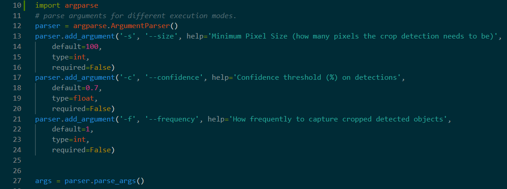
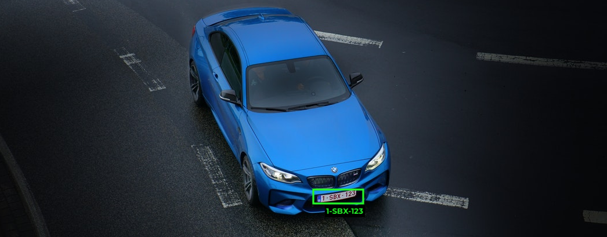

# YOLOv5 and OCI: Custom PyTorch Code From Scratch

## Introduction

In this article, we're going to learn how to load a YOLOv5 model into PyTorch, and then augment the detections with three different techniques:

1. Sorting Detections 
2. Cropping and saving detections
3. Counting Detected Objects

If you're a little confused on how we got here from the very beginning, you can check out the first and second article (this article's predecessors) here:

- [Creating a CMask Detection Model on OCI with YOLOv5: Data Labeling with RoboFlow](https://medium.com/oracledevs/creating-a-cmask-detection-model-on-oci-with-yolov5-data-labeling-with-roboflow-5cff89cf9b0b)
- [Creating a Mask Model on OCI with YOLOv5: Training and Real-Time Inference](https://medium.com/oracledevs/creating-a-mask-model-on-oci-with-yolov5-training-and-real-time-inference-3534c7f9eb21)

Additionally, [I give you here a Kaggle link](https://www.kaggle.com/datasets/jasperan/covid-19-mask-detection/) where you can download the pre-trained weights file for the model itself. I'll appreciate any contribution that improves the model's mAP (Mean Average Precision).

I recommend you check all these resources out, as these previous articles will hugely clarify what we do and how we obtained the data.

## Why PyTorch?

I decided to create a "modified" version of what YOLOv5 does, by taking advantage of Ultralytics' integration with PyTorch.

I believed custom PyTorch code would be great, because simply using YOLOv5's repository didn't give you 100% flexibility and responsiveness (real-time), so I decided to __very slightly__ add some *extra* functionalities (we'll talk about them below). If you're trying to use [the standard GitHub repository for YOLOv5](https://github.com/ultralytics/yolov5), you'll find that you can use their code like [this detector](https://github.com/ultralytics/yolov5/blob/master/detect.py) to post-process video or image files. You can also use it directly with a YouTube video, and an integrated youtube downloader will download frames and process them.

But what is the definition of real time? I want every frame that I see in my computer, somehow (be it either a camera frame from my webcam or a YouTube video, or even my screen) to display the results of my detection immediately. This is why I created my own custom code to detect with PyTorch.

Finally, I'd like to mention my journey through a *very painful* road of finding *a few* bugs on the Windows Operating System and trying to *virtualize* your webcam feed. There's this great plugin that could "replicate" your camera feed into a virtual version that you could use in any program (you could give your computer any program / input and feed it into the webcam stream, so that it looked like your webcam feed was coming from somewhere else), and it was really great:

This was an [OBS (Open Broadcaster Software)](https://obsproject.com/) plugin. OBS is the go-to program to use when you're planning to make a livestream. However, this plugin was discontinued in OBS version 28, and all problems came with this update. I prepared this bug-compilation image so you can feel the pain too:

So, once we've established that there are several roadblocks that prevent us from happily developing in a stable environment, we finally understand the "why" of this article. Let's begin implementing.

## Implementation

We are going to focus on the three problems explained in the Introduction: cropping and saving objects, counting objects and sorting them. These techniques can be re-used in any computer vision projects, so once you understand how to implement them once, you're good to go.

Technical requirements are Python 3.8 or higher, and PyTorch 1.7 or higher. [Here's a list](https://github.com/oracle-devrel/devo.publishing.other/custom_pytorch_yolov5/files/requirements.txt) of the project's requirements if you want to reuse the code (which you can find in [the GitHub repository](https://github.com/oracle-devrel/devo.publishing.other/custom_pytorch_yolov5)), along with everything we publish.

### 0. General Setup

First, we will use the `argparse` to include additional parameters to our Python script. I added three optional parameters:

> **Note**: the confidence threshold will only display detected objects if the confidence score of the model's prediction is higher than the given value (0.0-1.0).

These argparse parameters' default values can always be modified. The _frequency_ parameter will determine how many frames to detect (e.g. a frame step). If the user specifies any number N, then only 1 frame every N frames will be used for detection. This can be useful if you're expecting your data to be very similar within sequential frames, as the detection of one object, in one frame, will suffice. Specifying this frame step is also beneficial to avoid cost overages when making these predictions (electricity bill beware, or OCI costs if you're using Oracle Cloud).

After this initial configuration, we're ready to load our custom model. You can find the pre-trained custom model's weights for the Mask Detection Model being featured [in this link](https://www.kaggle.com/datasets/jasperan/covid-19-mask-detection?select=best.pt). You'll need to have this file within reach of your Python coding/execution environment to work.

So, we now load the custom weights file: 

> **Note**: we specify the model as a custom YOLO detector, and give it the model's weights file as input.

Now, we're ready to get started. We create our main loop, which constantly gets a new image from the input source (either a webcam feed or a screenshot of what we're seeing in our screen) and displays it with the bounding box detections in place:

The most important function in that code is the `infer()` function, which returns an image and the result object, transformed into a pandas object for your convenience.

In this first part of the function, we obtain a new image from the OpenCV video capture object. You can also find a similar implementation but by taking screenshots, instead of using the webcam feed in [this file](https://github.com/oracle-devrel/devo.publishing.other/custom_pytorch_yolov5/files/lightweight_screen_torch_inference.py) 

Now, we need to pass this to our Torch model, which will return bounding box results. However, there's an important consideration to make: since we want our predictions to be as fast as possible, and we know that the mask detection model has been trained with thousands of images of all shapes and sizes, we can consider a technique which will benefit Frames Per Second (FPS) on our program: **rescaling** images into a lower resolution (since my webcam feed had 1080p resolution, and I use a 2560x1440 monitor which causes screenshots to be too detailed, more than I need). 
For this, I chose a `SCALE_FACTOR` variable to hold this value (between 0-1). Currently, all images will be downscaled to 640 pixels in width and the respective resolution in height, to maintain the original image's aspect ratio.

Now that we have our downscaled image, we pass it to the model, and it returns the object we wanted:

> **Note**: the `size=640` option tells the model we're going to pass it images with that width, so the model will predict results of those dimensions.

The last thing we do is draw the bounding boxes that we obtained into the image, and return the image to display it later.

## 1. Sorting Detections

This first technique is the simplest, and can be useful to add value to the standard YOLO functionality in an unique way. The idea is to quickly manipulate the PyTorch-pandas object to sort values according to one of the columns. 

For this, I suggest two ideas: sorting by confidence score, or by detection coordinates. To illustrate how any of these techniques are useful, let's look at the following image: 

> **Note**: this image illustrates how sorting detections can be useful. [(image credits)](https://www.linkedin.com/in/muhammad-moin-7776751a0/)

In the image above, an imaginary line is drawn between both sides of the roadway, in this case **horizontally**. Any object passing from one equator to the other in a specific direction is counted as an "inward" or "downward" vehicle. This can be achieved by specifying (x,y) bounds, and any item in the PyTorch-pandas object that surpasses it in any direction is detected.

For processing purposes, sorting these values from the lowest y coordinate to the highest will return all cars in-order, from top to bottom of the image, which facilitates their processing in an ordered manner. 

### 2. Cropping & Saving Detections

With this second technique, we just need to crop the detected area we want and save it.

It's useful because we can manipulate or use the cropped image of an object, instead of the whole image instead, and use this to our advantage. As an example, you could:
1. Crop images where you detect text
2. Give this cropped image to an Optical Character Recognition (OCR) program
3. Extract the text in real-time

> **Note**: this is an example of a car's license plate being passed through an OCR in Keras. [(image credits)](https://medium.com/@theophilebuyssens)

This approach wouldn't work if we gave the whole image to the OCR, as it wouldn't be able to confidently recognize such small texts (that represent only a fraction of the screen), unless the image's resolution was very high (which in most cases isn't the case, just like in surveillance cameras).

To implement this, we will base everything we do on **bounding boxes**. Our PyTorch code will return an object with bounding box coordinates for detected objects (and the detection's confidence scores), and we will use this object to create newly cropped images with the bounding box sizes.
> **Note**: you can always modify the range of pixels you want to crop in each image, by being either more **permissive** (getting extra pixels around the bounding box) or more **restrictive**, removing the edges of the detected object.

An important consideration is that, since we're passing images to our model with a width of 640 pixels, we need to keep our previously-mentioned `SCALE_FACTOR` variable. The problem is that the original image has a higher size than the downscaled image (the one we pass the model), so bounding box detection coordinates will also be downscaled. We need to multiply these detections by the scale factor in order to _draw_ these bounding boxes over the original image; and then display it:

We use the `save_cropped_images()` function to save images, while also accounting for the frequency parameter we set: we'll only save the cropped detections in case the frame is one we're supposed to save.
Inside this function, we will **upscale** bounding box detections. Also, we'll only save the image if the detected image is higher than (x,y) width and height:

Last thing we do is save the cropped image with OpenCV:

And we successfully implemented the functionality.

## 3. Counting Detected Objects

This last technique we're going to learn about is very straightforward and easy to implement: since we want to count the number of detected objects in the screen, we need to use a global variable (in memory) or a database of some sort to store this variable. We can either design the variable to either:
1. Always increment, and keep a global value of all detected objects since we started executing our Python program
2. Only hold the value of currently detected objects in the screen

Depending on the problem, you may want to choose one of these two options. In our case, we'll implement the second option:

> **Note**: to implement the first option, you just need to *increment* the variable every time, instead of setting it. However, you might benefit from looking at implementations like [DeepSORT](https://github.com/ZQPei/deep_sort_pytorch) or [Zero-Shot Tracking](https://github.com/roboflow/zero-shot-object-tracking), which is able to recognize the same object/detection from sequential frames, and only count them as one; not separate entities. 

With our newly-created global variable, we'll hold a value of our liking. For example, in the code above, I'm detecting the _`mask`_ class. Then, I just need to draw the number of detected objects with OpenCV, along with the bounding boxes on top of the original image:

As an example, I created this GIF.

Note that I tested this on my own computer with an RTX 3080, I got about 25 FPS **with no downscaling** of images (I used their standard resolutions of 2560x1440). If you use downscaling you'll notice huge improvements in FPS.

## Conclusions

I've shown three additional features not currently present in YOLO models, by just adding a Python layer to it. PyTorch's Model Hub ultimately made this possible, as well as RoboFlow (made creating and exporting the mask detection model easy).

In the future, I'm planning on releasing an implementation with either DeepSORT or Zero-Shot Tracking, together with YOLO, to track objects. If you'd like to see any additional use cases or features implemented, let me know in the comments!

If you’re curious about the goings-on of Oracle Developers in their natural habitat like me, come join us [on our public Slack channel!](https://bit.ly/odevrel_slack) We don’t mind being your fish bowl 🐠.

Stay tuned...

## Acknowledgments

* **Author** - [Nacho Martinez](https://www.linkedin.com/in/ignacio-g-martinez/), Data Science Advocate @ Oracle Developer Relations
* **Last Updated By/Date** - February 7th, 2023