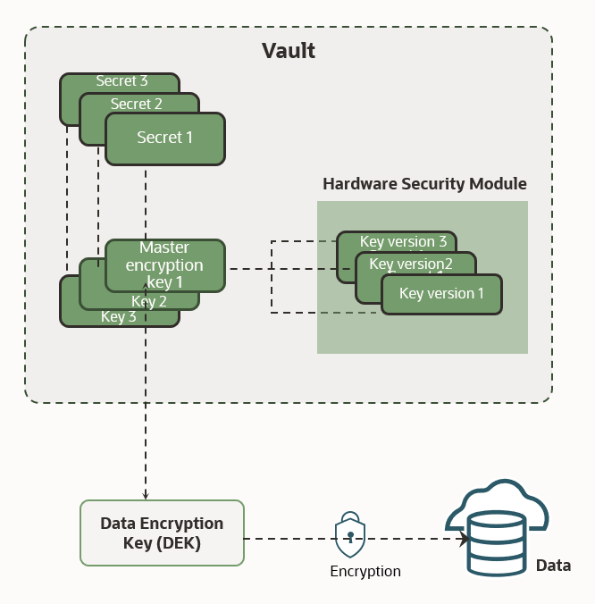
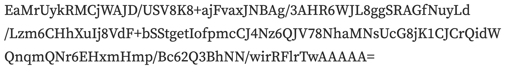

Chances are you have a set of keys on you, or nearby. It’s a comforting thought that we can control access to our vehicle, home, post box, or anything needing a key by just reaching into a pocket and grabbing our keys. That idea is quite similar to how OCI Vault was designed. A sort of “central store” of keys for cloud operations, allowing users or an API to access what is needed without messing about with unsecured text files or personal password managers. Yes, tools like personal password managers are useful, but at scale we need a way to authenticate both automated and manual processes in a secure way without constantly regenerating new keys.



Enter: OCI Vault! Here’s a top-down view of how it works, and an example of Vault in practice.

You can read the full docs on Vault on [docs.oracle.com](https://docs.oracle.com/en-us/iaas/Content/KeyManagement/home.htm).

You can also check out useful Vault articles at [developer.oracle.com/](https://developer.oracle.com/).

The architecture of Vault is quite simple. You can store keys, secrets, even hardware security modules (the keys for them) in Vault. These stored values use a Data Encryption Key (DEK) for encryption. As you can see in the docs, [Oracle supports a variety of encryption methods](https://docs.oracle.com/en-us/iaas/Content/KeyManagement/Tasks/managingkeys_topic-To_create_a_new_key.htm) — choose your own adventure!

Most importantly, the master encryption keys can be used in a variety of ways, including (but not limited to) rotating keys, creating vaults, metadata management, and encrypting/decrypting data at rest or in transit. That last one is important, as we may have data flowing through a stream, stored in buckets, or in a file system. The Vault service can handle all of those with aplomb, making processes easier and more secure when you go to create new projects or manage existing ones.

Oracle provides a considerable amount of flexibility with Vaults, too. The [docs tell the full story](https://docs.oracle.com/en-us/iaas/Content/KeyManagement/Tasks/managingvaults.htm), but suffice it to say you can start with a very simple vault for testing and scale up as needed (keep in mind pricing will also scale up). Ultimately Vaults are “logical entities”; in other words, a representation of “things” consumed or produced by logical activities.

### Getting Started: What's a key?


What’s a vault without a key, right? In practice, it’s a little more complicated than just _one_ key. If you think about the real world, we have keys that open doors, but also “keys” in the form of cryptographic keys that can create text that is (virtually) indecipherable without the key to decode it. Thus, the Vault service recognizes three types of encryption keys: master encryption keys, wrapping keys, and data encryption keys. You can [read more about keys here](https://docs.oracle.com/en-us/iaas/Content/KeyManagement/Concepts/keyoverview.htm#concepts). In some cases, the type of key you use will also dictate what type of encryption you use.

#### Master Encryption Keys
The encryption algorithms that the Vault service supports for vault master encryption keys include [AES](https://www.techtarget.com/searchsecurity/definition/Advanced-Encryption-Standard), [RSA](https://www.techtarget.com/searchsecurity/definition/RSA), and [ECDSA](https://en.wikipedia.org/wiki/Elliptic_Curve_Digital_Signature_Algorithm). You can create AES, RSA, or ECDSA master encryption keys by using the Console, CLI, or API. When you create a master encryption key, the Vault service can either generate the key material internally or you can import the key material to the service from an external source. (Support for importing key material depends on the encryption algorithm of the key material.) When you create vault master encryption keys, you create them in a vault, but where a key is stored and processed depends on its protection mode. Note that we’ll be discussing software keys, but Oracle supports hardware security modules as well (called HSM in the docs), which might be a physical dongle or number generator, etc. That sort of security is not only more advanced, but more expensive as well. For a software-protected key, any processing related to the key happens on the server.

#### Wrapping Keys

Oracle offers an array of inherent security features, and "wrapping keys" are a good example. This type of encryption key comes included with each vault by default! Despite that rhyme, it’s a _wrapping_ key, not a rapping key. A wrapping key is a 4096-bit asymmetric encryption key based on the RSA algorithm. The public and private key pair do not count against service limits. They also do not incur service costs. You use the public key as the key encryption key when you need to wrap key material for import into the Vault service. You cannot create, delete, or rotate wrapping keys.

#### Encryption Keys

Encryption Keys are keys you can rotate. Periodically rotating keys limits the amount of data encrypted or signed by one key version. If a key is ever compromised, key rotation reduces the security risk. A key’s unique, Oracle-assigned identifier, called an Oracle Cloud ID (OCID), remains the same across rotations, but the key version lets the Vault service seamlessly rotate keys to meet any compliance requirements you might have.

While hardware security modules are available, we won’t dive into those in this explainer, but again [it’s in the docs](https://docs.oracle.com/en-us/iaas/Content/KeyManagement/Tasks/managingkeys_topic-To_create_a_new_key.htm)…

### Getting Started: Secrets

Secrets are credentials such as passwords, certificates, SSH keys, or authentication tokens that you use with Oracle Cloud Infrastructure services. The key here (pun intended?) is that it’s a lot safer to store these in the Vault than in configuration files or in code. Perhaps you’ve read about user data being stored in apps as plaintext? Yeah, that’s not a good idea. So it’s important to guard these secrets, just like the formula for Coca-Cola. Secrets, like keys, can be rotated, rolled back (in a secure manner), and imported/exported. Like many Vault features, you can create secrets via the Console, your favorite CLI, or even an API. We’ll choose one of those adventures later.

A vault secret bundle consists of the secret contents, properties of the secret and secret version (such as version number or rotation state), and user-provided contextual metadata for the secret. That’s why they’re called a bundle – it wraps everything up in a nice little bundle for Vault to manage as needed. Handy if you have a security breach or data loss and need to recover something.

#### Where in the world are my Vaults? And what are my limits?

As the title of this article suggest, this article is for absolute beginners. While we can’t anticipate every use case, the documentation has this covered. Take good stuff like availability domains, for example. Vaults will duplicate across things like availability domains, and within fault domains, etc. All you have to know for now is that OCI’s priority is to allow access to your keys and secrets when you need them and is highly fault-tolerant without a bunch of messing about with trying to copy stuff over, or any other overhead hassles. It’s one of the coolest features of working in OCI to begin with!

However, depending on your needs you’ll want to keep an eye on costs. That’s where things like service limits come into play. Free tier, for example, won’t have as many bells and whistles as someone using a higher-priced tier with more features. You can still do a LOT of things with free tier, but in order to keep costs low overall and keep the services reliable and scalable, it’s good to familiarize yourself with the [concepts of our service limits in this document](https://docs.oracle.com/en-us/iaas/Content/General/Concepts/servicelimits.htm#top).

#### Other cool OCI stuff!

Your Vaults work flawlessly with VCN’s, so you can restrict access via the network connections you specify, and they support OCID, our method of tracking unique resources. You can also manage Vault access by prudent use of groups, compartments, and policies. Speaking of access, did I mention you can hop into all this right from your browser using the OCI Console? There’s also a REST API, SDK, and of course you can use a CLI from the comfort of your own machine.

We also support hardware security modules (HSM), adding a layer of physical security to Vault operations. While it’s beyond the scope of this article, here are a couple of key points from the docs about this feature:
“After you create the resources, the service maintains copies of any given key version or secret version within the service infrastructure to provide resilience against hardware failures. Key versions of HSM-protected keys are not otherwise stored anywhere else and cannot be exported from an HSM.

When you create an RSA or ECDSA asymmetric master encryption key with the protection mode set to HSM, the Vault service stores the private key within an HSM and does not allow its export from the HSM. However, you can download the public key.”

### Vault Management


Now let’s get down to brass tacks. Let’s create a Vault, create a key, and use it. It’s like starting your own bank but with 99% less regulatory oversight! Of course, we’ll be flying high above here, hitting the important notes, but everything you need to know is in the documentation, of course. My goal is to demystify OCI Vault for first-timers, and show how easy it is to get started.

We'll do all this in the Console, but you can, of course, do it from a command line or via API, depending on your needs. I think a future article will focus on the API track, as this is handy for developers who will need to manage a number of keys, secrets, and so forth when creating applications. We’re (hopefully) a long way past storing user keys in plaintext files in our applications, right? 

One important note: You cannot change the vault type after the vault is created. So, if you make a virtual private vault, you can’t later open that up. Again, using modern best practices assumes you’ve scoped out who needs this vault and how they’ll be using it. 

Also, we’re assuming you’re the admin of this OCI account – IAM policies are robust and at times labyrinthine in OCI for good reason. You can specify with extreme granularity how every resource in your tenancy is used. That’s both good resource management and good security practice. Now, let’s get to it.

HOW TO CREATE A VAULT IN CONSOLE:

1.  Open the navigation menu, click **Identity & Security**, and then click **Vault**.
2.  Under List Scope, in the Compartment list, click the name of the compartment where you want to create the vault.
3.  Click **Create Vault**.
4.  In the Create Vault dialog box, click **Name**, and then enter a display name for the vault. Avoid entering confidential information.
5.  Optionally, make the vault a virtual private vault by selecting the "Make it a virtual private vault" check box. For more information about vault types, see Key and Secret Management Concepts.
6.  If you have permissions to create a resource, then you also have permissions to apply free-form tags to that resource. To apply a defined tag, you must have permissions to use the tag namespace. For more information about tagging, see Resource Tags. If you are not sure whether to apply tags, skip this option (you can apply tags later) or ask your administrator.
7.  When you are finished, click **Create Vault**.

Well, now that you have a shiny new vault, you’ll need a set of master keys to open it or lock it, right? Just like a bank! We’ll create a _Master Encryption Key_ for this purpose, and again use Console to do it.

### Key Management

HOW TO CREATE A MASTER ENCRYPTION KEY:

1.  Open the navigation menu, click **Identity & Security**, and then click **Vault**.
2.  Under List Scope, in the Compartment list, click the name of the compartment where you want to create the key.
3.  Click the name of the vault where you want to create the key.
4.  Click **Master Encryption Keys**, and then click **Create Key**.
5.  In the Create Key dialog box, choose a compartment from the Create in Compartment list. (Keys can exist outside the compartment the vault is in.)
6.  Click **Protection Mode**, and then choose **Software**. (NOTE: This is the one you want, as HSM’s are a bit overkill for this first experience). You can’t change this later, but we won’t need to in this example.
7.  Click **Name**, and then enter a name to identify the key. Avoid entering confidential information.
8.  Click **Key Shape: Algorithm**, and then choose from one of the following algorithms:
	- AES. Advanced Encryption Standard (AES) keys are symmetric keys that you can use to encrypt data at rest.
	- RSA. Rivest-Shamir-Adleman (RSA) keys are asymmetric keys, also known as key pairs consisting of a public key and a private key, that you can use to encrypt data in transit, to sign data, and to verify the integrity of signed data.
	- ECDSA. Elliptic curve cryptography digital signature algorithm (ECDSA) keys are asymmetric keys that you can use to sign data and to verify the integrity of signed data.
9.  Depending on what you chose in the previous step, either click **Key Shape: Length** or **Key Shape: Curve ID**, and then choose the key length, in bits, for AES and RSA keys, or specify the curve ID for ECDSA keys. For AES keys, the Vault service supports keys that are exactly 128 bits, 192 bits, or 256 bits in length. For RSA keys, the service supports keys that are 2048 bits, 3072 bits, or 4096 bits. With ECDSA keys, you can create keys that have an elliptic curve ID of NIST_P256, NIST_P384, or NIST_P521.
10. Optionally, to apply tags, click **Show Advanced Options**. (We’re not covering tags in this article, but they are SUPER handy for organizing resources, especially across various resources in OCI and are worth the time to master as you grow your expertise or the size of your projects!) If you have permissions to create a resource, then you also have permissions to apply free-form tags to that resource. 
11. When you are finished, click **Create Key**. 

Not too bad, eh? Again, tags are great, but for now we’ll zoom past them. And side note, the operation [CreateKey](https://docs.oracle.com/iaas/api/#/en/key/latest/Key/CreateKey) is how we’d create a key using the API. Logical, no?

Now, there’s actually a few more steps. While our steps created a key, we need to _enable_ it as well. That’s easy enough from the Console:
1.  Open the navigation menu, click **Identity & Security**, and then click **Vault**.
2.  Under List Scope, in the Compartment list, click the name of the compartment that contains the vault with the key you want to enable.
3.  From the list of vaults in the compartment, click the vault name.
4.  Click **Master Encryption Keys**, locate the key you want to enable, and then select the check box next to the key name. (If needed, first change the list scope to the compartment that contains the key.)
5.  In the Actions menu, click **Enable**. 

Of course, as you can see in our docs, you can rotate keys (good practice is to do this at set intervals), disable or delete keys, view and update them, and so on. But wait a moment… _delete a key?_ Yeah, as you might imagine that’s a bit like when Uncle Billy lost the deposits to the Savings and Loan in It’s a Wonderful Life – chaos can ensue. As the docs state:

> When you set a key to the Pending Deletion state, anything encrypted by that key immediately becomes inaccessible. This includes secrets. The key also cannot be assigned or unassigned to any resources or otherwise updated. When the key is deleted, all key material and metadata is irreversibly destroyed. Before you delete a key, either assign a new key to resources currently encrypted by the key or preserve your data another way. If you want to restore use of a key before it is permanently deleted, you can cancel its deletion.

Whew, so you have a bit of a chance to step back from oblivion should someone accidentally try to delete a key that is needed to access secrets or other resources tied to that key. Note that this doesn’t destroy the Vault, but it is something you need to be wary about!

### Assigning Keys

OK, sure, you’ve created keys and enabled them, but now they’re just sitting on a desk (so to speak). The rubber hits the road when we assign them to resources! Keep in mind that if you remove a Vault master encryption key assignment from a resource, the service returns to using an Oracle-managed key for cryptography. What’s cool is that you can assign master encryption keys that you manage to block or boot volumes, databases, file systems, buckets, and stream pools. Block Volume, Database, File Storage, Object Storage, and Streaming use the keys to decrypt the data encryption keys that protect the data that is stored by each respective service. 

But wait, there’s more! You can also assign master encryption keys to clusters that you create using [Container Engine for Kubernetes](https://www.oracle.com/cloud/cloud-native/container-engine-kubernetes/) to encrypt Kubernetes secrets at rest in the etcd key-value store. 

However, it’s important to note that “Keys associated with volumes, buckets, file systems, clusters, and stream pools will not work unless you authorize Block Volume, Object Storage, File Storage, Container Engine for Kubernetes, and Streaming to use keys on your behalf. Additionally, you must also authorize users to delegate key usage to these services in the first place.” Plus, keys connected to databases won’t work unless you authorize a Dynamic Group (link TK) that includes all the nodes in the DB system to manage keys in the tenancy. For more information, see [Required IAM Policy in Exadata Cloud Service](https://docs.oracle.com/iaas/exadatacloud/exacs/preparing-for-ecc-deployment.html#GUID-EA03F7BC-7D8E-4177-AFF4-615F71C390CD). And for more information on [delegating key usage see here](https://docs.oracle.com/en-us/iaas/Content/Identity/Concepts/commonpolicies.htm#os-bv-admins-use-key-id), and for various storage and containers, [check out these docs](https://docs.oracle.com/en-us/iaas/Content/Identity/Concepts/commonpolicies.htm#services-use-key).

Anyway, back to the fun stuff. One of the more common places to put your “things” in OCI will be in an Object Storage Bucket. As the name implies, it’s a basic storage place for all kinds of things in your compartment, but you can [read more about object storage buckets here](https://docs.oracle.com/en-us/iaas/Content/Object/Tasks/managingbuckets.htm). As with nearly everything in OCI, there are lots of ways to control access to buckets (IAM policies, of course), but for our purposes we’re going to encrypt our bucket using our Vault’s service master encryption key. If you think about this, it’s like Mission Impossible, where Tom Cruise tries to get into a secure location but after negotiating several layers of security policies, finds that the hard drive is ALSO encrypted. I guess that’s why they make sequels, right?

Likewise, we’ll encrypt our storage bucket and use the master key to get in. To assign our previously-enabled key in the Console, it’s pretty easy:
1.  Open the navigation menu and click **Storage**. Under Object Storage, click **Buckets**.
2.  Under List Scope, in the Compartment list, choose the compartment where you want to create a bucket that's encrypted with a Vault service master encryption key.
3.  Click **Create Bucket**, and then follow the instructions in [Creating a Bucket](https://docs.oracle.com/en-us/iaas/Content/Object/Tasks/managingbuckets_topic-To_create_a_bucket.htm#top).

Note that keys can be assigned to boot volumes, block volumes, file systems and more. Just remember that any objects have to be authorized to use these keys to begin with! That’s true of REST API’s, CLI, or the Console. 

### Using Keys

Oh yeah, you’ll want to use those keys, right? As you may already know, the key to using the keys (pun intended) is viewing the Public Key so you can use that. To view the asymmetric public key using the OCI Console:
1.  Open the navigation menu, click **Identity & Security**, and then click **Vault**.
2.  Under List Scope, in the Compartment list, click the name of the compartment that contains the vault with the key you want to rotate.
3.  From the list of vaults in the compartment, click the vault name.
4.  Click **Master Encryption Keys**, and then click the name of the master encryption key that you want to rotate to a new key version.
5.  In the list of key versions, find the key for which you want to view the public key, click the **Actions** menu, and then click **View Public Key**.
6.  Then, do one of the following:
	* To copy the contents of the public key, click **Copy**. The contents of the public key are copied to your clipboard.
	* To download the public key, click **Download**. The file is automatically downloaded to your local computer.
7.  When you are finished, click **Close**. 

### Encrypting and Decrypting Data using Master Encryption Key


Now we must shift gears a bit. Because certain tasks are not accessible in the Console, for good (security) reasons. Much of what you’ll be doing with keys involves encrypting and decrypting data, which simply isn’t part of what the Console does. That’s more likely going to happen in your application via API or in a CLI when building your application. Thus, we’ll switch to a CLI for now…

You can bring your own CLI to the party and SSH into your compute instance OR you can just use Cloud Shell in the Console. We’ll assume the latter (because you may not even have an instance set up, but Cloud Shell will instantiate what you need to proceed).

And here’s a very important note: 

> You can use either AES symmetric keys or RSA asymmetric keys to encrypt or decrypt data. ECDSA keys do not support vault cryptography required to encrypt or decrypt data. If you want to encrypt data by using an RSA asymmetric key, then you must also provide the --key-version-id of the key. To decrypt the data, you need to provide the same --key-version-id. The need to track key versions exists because, unlike symmetric keys, an asymmetric key's ciphertext does not contain the information that the service needs for decryption purposes.


Now let’s look at how this works in practice. Bear in mind some assumptions we’ve made, specifically that we’ve created a resource (like a storage bucket), and a key (which we’ve enabled), and a Vault. We’ve also copied our public key and put it somewhere we can get to. 

Essentially we spun up a data resource worth encrypting, which has an endpoint (which is how you’d access it if you were performing normal data operations on it). This data plane will be needed in order to encrypt it, as we have to tell OCI where our data is (like ordering a pizza, they need your address). Of course, this could be a MySQL database or whatever, but they’ll all have an endpoint for you to use (which could be private or public, it just depends on what you plan to do with it).

We also created a key and viewed the asymmetric public key as noted earlier. In my case I’ll use an RSA asymmetric key because I already viewed and stored my public key on my local drive. 

The format OCI is expecting will look like this:

	oci kms crypto encrypt --key-id <key_OCID> --plaintext <base64_string> --endpoint <data_plane_url>


The Key ID you can get from the Console via **Identity & Security** > **Vault**. Under List Scope in the Compartment list, you’ll choose the compartment where you created that key. Choose the Vault you created earlier. And in Master Encryption Keys the console will show you all the pertinent info, like OCID, when it was created, what compartment it’s in, etc. Yep, that OCID for the key is what you’ll put in `<key_OCID>`.

You’ll plug the public key into `<base64_string>` which is, of course, plain text. And then there’s the endpoint, which will be the URL of your data object, whatever it may be.

There’s an optional parameter here too, called associated-data. This must be properly-formatted JSON, but you can add information that doesn’t need to be secret info just about the encrypted data. Here’s an example of all of this put together plus some associated data for fun:

```
oci kms crypto encrypt --key-id ocid1.key.region1.sea.exampleaaacu2.examplesmtpsuqmoy4m5cvblugmizcoeu2nfc6b3zfaux2lmqz245gezevsq --plaintext VGhlIHF1aWNrIGJyb3duIGZveCBqdW1wcyBvdmVyIHRoZSBsYXp5IGRvZy4= --associated-data '{"CustomerId":"12345", "Custom Data":"custom data"}' --endpoint https://exampleaaacu3-crypto.kms.us-ashburn-1.oraclecloud.com
```

Pretty cool, yeah? 

### Decrypting Data

To decrypt our data, well, it’s time for a little fishing trip to the old API watering hole. Yep, you can’t do this in Console (why would you?) and you can’t really do it in the CLI either (although you can use the CLI to make a call to the Vault Service’s API). Well, you sort of can, but it’s like running python commands in VS Code – really you’re just testing things out. Decrypting data is normally one of those things you do when you’re DOING something with your data. That’s why we’ll use an API call to access the data, decrypt it, and then send it along for whatever processing we need to do to it. I won’t cover every scenario here, but I will point out all the trails you might want to hike depending on the languages and tools you might use (although it’s still not an exhaustive list, and we may add more as time goes on – that’s progress for you!). 

Lucas Jellema has a [great example in this Medium article](https://medium.com/oracledevs/oracle-cloud-infrastructure-vault-service-to-generate-manage-and-encrypt-decrypt-using-keys-4122c3ef80b0), where he takes the opening text of Anna Karanenina and uses the OCI CLI to make a call to the Vault Service’s API thusly:

```bash
keys=$(oci kms management key list -c $compartmentId --endpoint $vaultManagementEndpoint)

export keyOCID=$(echo $keys | jq -r --arg display_name "lab-key" '.data | map(select(."display-name" == $display_name)) | .[0] | .id')

toEncrypt=$(echo "Happy families are all alike,every unhappy family is unhappy in its own way." | base64)

# the next line removes the spaces from $toEncrypt variable 

toEncrypt=$(echo $toEncrypt| tr -d ' ')

encrypted=$(oci kms crypto encrypt --key-id $keyOCID --plaintext $toEncrypt --endpoint $vaultCryptoEndpoint)

export cipher=$(echo $encrypted | jq -r '.data | .ciphertext')

echo "This is the result of the encryption, a text that we can send anywhere and that no one will understand: $cipher"
```

If someone were to try and look at the output of this without the key, they’d see a bunch of nonsense!



So we want to use this text and make it readable, and to do that we’ll use the key in the vault. In Lucas’s example (note he’s using base64 encoding which is used to encode binary data as printable text):

```bash
decrypted=$(oci kms crypto decrypt --key-id $keyOCID  --ciphertext $cipher --endpoint $vaultCryptoEndpoint)

export b64encodedPlaintext=$(echo $decrypted | jq -r '.data | .plaintext')

echo $b64encodedPlaintext | base64 --decode
```

Let’s dissect this a bit. Above this block of code is where you’d put the encrypted data. That mess of gibberish that was spat out previously in his example. 

First, we use `$decrypted` to pass along our `decrypt` command with the keyID parameter, the ciphertext, and a Vault endpoint. Of course, these values are set using pretty clear names in his example (keyOCID and so on). We then tell the system to export the decrypted data as plaintext, specifically using base64 so we can, you know, read it (unless you tend to read binary code!).

Todd Sharp also has a [great rundown of how to go from zero to Vault with decrypted text](https://blogs.oracle.com/developers/post/protect-your-sensitive-data-with-secrets-in-the-oracle-cloud) in a short time, and adds in a serverless function that will retrieve and decrypt secrets for you. As we discussed earlier, he uses the OCI Console to create a Vault, a key, and a secret (in Jellema’s article he’s just using some plaintext, not actually a “secret” per se). 

Todd copies the OCID of the secret, and then uses that in the function to direct the system to the proper place. He also dives into the dependencies you’ll need to work with for the OCI SDK and an extra bit you’ll need if you’re using anything above Java 8.

Secrets are particularly useful when you’re building applications, especially if you’re joining us in the 21st century, where we take nothing for granted.

### Wrap Up

This has been a brief flyover of the OCI Vault service, how to get started, and where to go once you’ve got a vault and some keys generated. Of course, there’s a lot more to it than this (like those HSMs), but you can always drop into our [Oracle Developer Slack](https://bit.ly/odevrel_slack) to ask where to go from here, or try our [Free Tier](https://signup.cloud.oracle.com/?language=en) and kick the tires yourself. Enjoy!
