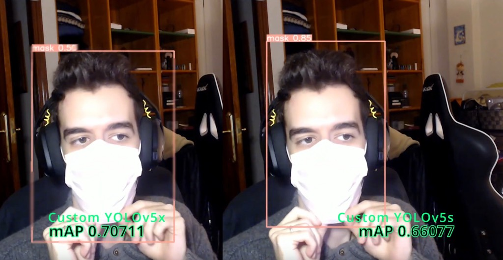
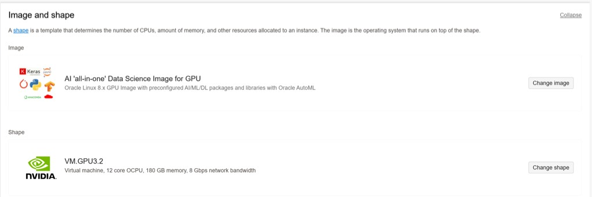
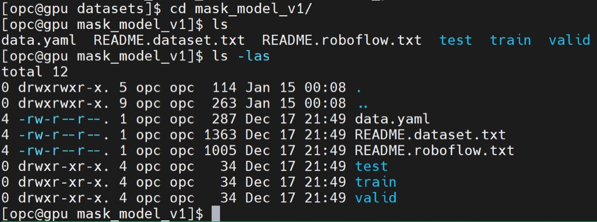
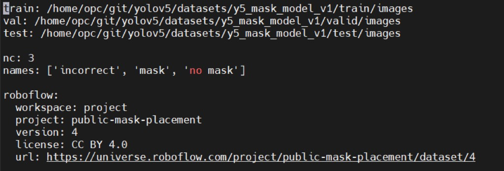
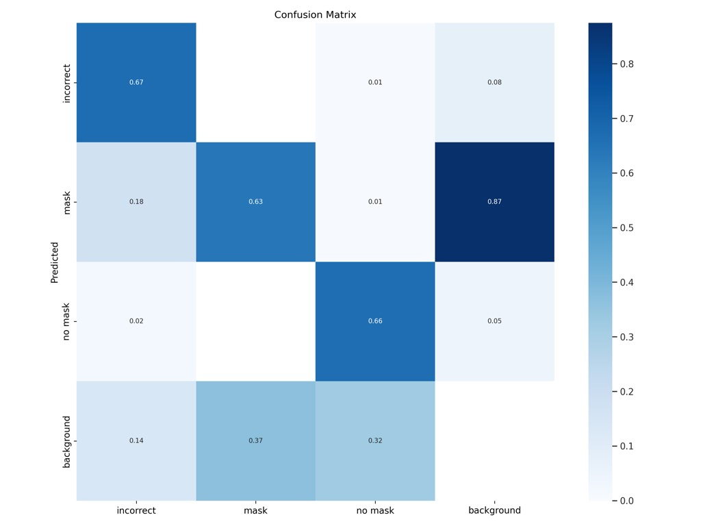
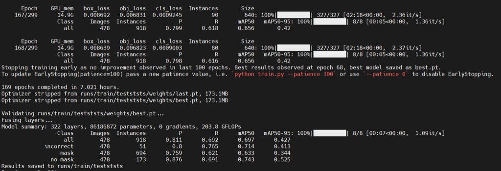

# Creating a Mask Model on OCI with YOLOv5: Training and Real-Time Inference

## Introduction

If you remember [an article I wrote a few weeks back](https://medium.com/oracledevs/creating-a-cmask-detection-model-on-oci-with-yolov5-data-labeling-with-roboflow-5cff89cf9b0b), I created a Computer Vision model able to recognize whether someone was wearing their COVID-19 mask correctly, incorrectly, or simply didn't wear any mask.

Now, as a natural continuation of this topic, I'll show you how you can train the model using Oracle Cloud Infrastructure (OCI). This applies to any object detection model created using the YOLO (You Only Look Once) standard and format.

At the end of the article, you'll see the end result of performing inference (on myself):



## Hardware?

To get started, I went into my Oracle Cloud Infrastructure account and created a Compute instance. These are the specifications for the project:

* Shape: VM.GPU3.2
* GPU: 2 NVIDIA® Tesla® V100 GPUs ready for action.
* GPU Memory: 32GB
* CPU: 12 cores
* CPU Memory: 180GB

I specifically chose an OCI Custom Image as the default Operating System for my machine. The partner image that I chose is the following



> **Note**: this custom image is very useful and often saves me a lot of time. It already has 99% of the things that I need to work on in any Data Science-related project. So, no installation/setup wasted time before getting to work. (It includes things like conda, CUDA, PyTorch, a Jupyter environment, VSCode, PyCharm, git, Docker, the OCI CLI... and much more. Make sure to read the [full custom image specs here](https://cloud.oracle.com/marketplace/application/74084544/usageInformation)).

### Price Comparison

The hardware that we're going to work with is [very expensive](https://www.amazon.com/PNY-TCSV100MPCIE-PB-Nvidia-Tesla-v100/dp/B076P84525), which nobody is expected to have access to in their homes. Nobody that I know has a $15,000 graphics card (if you know someone let me know), and this is where Cloud can really help us. OCI gives us access to these amazing machines for a fraction of the cost that you would find from a competitor.

For example, I rented both NVIDIA V100s *just for **$2.50/hr***, and I'll be using these GPUs to train my models.

> **Note**: Be mindful of the resources you use in OCI. Just like other Cloud providers, once you allocate a GPU in your Cloud account, you will still be charged for the use even if it's idle. So, remember to terminate your GPU instances when you're finished to avoid overcharges!

[Here's a link](https://www.oracle.com/cloud/price-list/) to the full OCI price list if you're curious.

## Training the Model with YOLOv5

Now I have my compute instance ready. And since I have almost no configuration overheads (I'm using the custom image), I can get straight to business.

Before getting ready to train the model, I have to clone YOLOv5's repository:

```console
git clone https://github.com/ultralytics/yolov5.git
```

And finally, install all dependencies into my Python environment:

```console
cd /home/$USER/yolov5
pip install -r /home/$USER/yolov5/requirements.txt
```

> **Note**: YOLOv8 was just released. I thought, "why not change directly to YOLOv8, since it's basically an improved version of YOLOv5?" But I didn't want to overcomplicate things -- for future content, I'll switch to YOLOv8 and show you why it's better than the version we are using for this article!


### Downloading my Dataset

[The model](https://universe.roboflow.com/jasperan/public-mask-placement) is public and freely available for anyone who wants to use it:


> **Note**: thanks to RoboFlow and their team, you can even [test the model in your browser](https://universe.roboflow.com/jasperan/public-mask-placement/model/4) (uploading your images/videos) or with your webcam!

I exported my model from RoboFlow in the YOLOv5 format. This downloaded my dataset into a ZIP file, including three different directories: training, testing, and validation, each with their corresponding image sets.

I pushed the dataset into my compute instance using FTP (File Transfer Protocol) and unzipped it:




Additionally, we have the `data.yaml` file containing the dataset's metadata.

To avoid absolute/relative path issues with my dataset, I also want to modify `data.yaml` and insert the *absolute* paths where all images (from training, validation, and testing sets) are found since by default they contain the relative path:



Now, we're almost ready for training.

### Training Parameters

We're ready to make a couple of extra decisions regarding which parameters we'll use during training.

It's important to choose the right parameters, as doing otherwise can cause terrible models to be created (the word *terrible* is intentional). So, let me explain what's important about training parameters. Official documentation can be found [here](https://docs.ultralytics.com/config/).

* `--device`: specifies which CUDA device (or by default, CPU) we want to use. Since I have two GPUs, I'll want to use both for training. I'll set this to "0,1", which will perform **distributed training**, although not in the most optimal way. (I'll make an article in the future on how to properly do Distributed Data Parallel with PyTorch).
* `--epochs`: the total number of epochs we want to train the model for. If the model doesn't find an improvement during training. I set this to 3000 epochs, although my model converged very precisely long before the 3000th epoch was done.
    
    > **Note**: YOLOv5 (and lots of Neural Networks) implement a function called **early stopping**, which will stop training before the specified number of epochs, if it can't find a way to improve the mAPs (Mean Average Precision) for any class.

* `--batch`: the batch size. I set this to either 16 images per batch, or 32. Setting a lower value (and considering that my dataset already has 10.000 images) is usually a *bad practice* and can cause instability.
* `--lr`: I set the learning rate to 0.01 by default.
* `--img` (image size): this parameter was probably the one that gave me the most trouble. I initially thought that all images -- if trained with a specific image size -- must always follow this size; however, you don't need to worry about this due to image subsampling and other techniques that are implemented to avoid this issue. This value needs to be the maximum value between the height and width of the pictures, averaged across the dataset.
* `--save_period`: specifies how often the model should save a copy of the state. For example, if I set this to 25, it will create a YOLOv5 checkpoint that I can use every 25 trained epochs.

> **Note**: if I have 1000 images with an average width of 1920 and height of 1080, I'll probably create a model of image size = 640, and subsample my images. If I have issues with detections, perhaps I'll create a model with a higher image size value, but training time will ramp up, and inference will also require more computing power.


### Which YOLOv5 checkpoint to choose from?

The second and last decision we need to make is which YOLOv5 checkpoint we're going to start from. It's **highly recommended** that you start training from one of the five possible checkpoints:


> **Note**: you can also start training 100% from scratch, but you should only do this if what you're trying to detect has never been reproduced before, e.g. astrophotography. The upside of using a checkpoint is that YOLOv5 has already been trained up to a point, with real-world data. So, anything that resembles the real world can easily be trained from a checkpoint, which will help you reduce training time (and therefore expense).

The higher the accuracy from each checkpoint, the more parameters it contains. Here's a detailed comparison with all available pre-trained checkpoints:

| Model | size<br><sup>(pixels)</sup> | Mean Average Precision<sup>val<br>50-95</sup> | Mean Average Precision<sup>val<br>50</sup> | Speed<br><sup>CPU b1<br>(ms)</sup> | Speed<br><sup>V100 b1<br>(ms)</sup> | Speed<br><sup>V100 b32<br>(ms)</sup> | Number of parameters<br><sup>(M)</sup> | FLOPs<br><sup>@640 (B)</sup> |
| ----- | ------------ | ------------------------------ | --------------------------- | --------------- | ---------------- | ----------------- | ----------------------- | ------------- |
| [YOLOv5n](https://github.com/ultralytics/yolov5/releases/download/v6.2/yolov5n.pt) | 640 | 28.0 | 45.7 | **45** | **6.3** | **0.6** | **1.9** | **4.5** |
| [YOLOv5s](https://github.com/ultralytics/yolov5/releases/download/v6.2/yolov5s.pt) | 640 | 37.4 | 56.8 | 98 | 6.4 | 0.9 | 7.2 | 16.5 |
| [YOLOv5m](https://github.com/ultralytics/yolov5/releases/download/v6.2/yolov5m.pt) | 640 | 45.4 | 64.1 | 224 | 8.2 | 1.7 | 21.2 | 49.0 |
| [YOLOv5l](https://github.com/ultralytics/yolov5/releases/download/v6.2/yolov5l.pt) | 640 | 49.0 | 67.3 | 430 | 10.1 | 2.7 | 46.5 | 109.1 |
| [YOLOv5x](https://github.com/ultralytics/yolov5/releases/download/v6.2/yolov5x.pt) | 640 | 50.7 | 68.9 | 766 | 12.1 | 4.8 | 86.7 | 205.7 |
|  |  |  |  |  |  |  |  |  |
| [YOLOv5n6](https://github.com/ultralytics/yolov5/releases/download/v6.2/yolov5n6.pt) | 1280 | 36.0 | 54.4 | 153 | 8.1 | 2.1 | 3.2 | 4.6 |
| [YOLOv5s6](https://github.com/ultralytics/yolov5/releases/download/v6.2/yolov5s6.pt) | 1280 | 44.8 | 63.7 | 385 | 8.2 | 3.6 | 12.6 | 16.8 |
| [YOLOv5m6](https://github.com/ultralytics/yolov5/releases/download/v6.2/yolov5m6.pt) | 1280 | 51.3 | 69.3 | 887 | 11.1 | 6.8 | 35.7 | 50.0 |
| [YOLOv5l6](https://github.com/ultralytics/yolov5/releases/download/v6.2/yolov5l6.pt) | 1280 | 53.7 | 71.3 | 1784 | 15.8 | 10.5 | 76.8 | 111.4 |
| [YOLOv5x6](https://github.com/ultralytics/yolov5/releases/download/v6.2/yolov5x6.pt)<br>+[TTA](https://github.com/ultralytics/yolov5/issues/303) | 1280<br>1536 | 55.0<br>**55.8** | 72.7<br>**72.7** | 3136<br>- | 26.2<br>- | 19.4<br>- | 140.7<br>- | 209.8<br>- |

> **Note**: all checkpoints have been trained for 300 epochs with the default settings (find all of them [in the official docs](https://docs.ultralytics.com/config/)). The nano and small version use [these hyperparameters](https://github.com/ultralytics/yolov5/blob/master/data/hyps/hyp.scratch-low.yaml), all others use [these](https://github.com/ultralytics/yolov5/blob/master/data/hyps/hyp.scratch-high.yaml).

Also note that -- if we want to create a model with an image size > 640 -- we should select the corresponding YOLOv5 checkpoints (those that end in the number `6`).

So, for this model, since I will use 640 pixels, I'll just create a first version using **YOLOv5s**, and another one with **YOLOv5x**. You only need to train one, but I was curious and wanted to see how each model differs in the end when applying it to the same video.

### Training

Now, we just need to run the following commands...

```console
 # for yolov5s
python train.py --img 640 --data ./datasets/y5_mask_model_v1/data.yaml --weights yolov5s.pt --name y5_mask_detection  --save-period 25 --device 0,1 --batch 16 --epochs 3000

# for yolov5x
python train.py --img 640 --data ./datasets/y5_mask_model_v1/data.yaml --weights yolov5x.pt --name y5_mask_detection  --save-period 25 --device 0,1 --batch 16 --epochs 3000
```

...and the model will start training. Depending on the size of the dataset, each epoch will take more or less time. In my case, with 10.000 images, each epoch took about 2 minutes to train and 20 seconds to validate.


For each epoch, we will have broken-down information about epoch training time and mAP for the model, so we can see how our model progresses over time. 

After the training is done, we can have a look at the results. The visualizations are provided automatically, and they are pretty similar to what I found using RoboFlow Train in the last article. I looked at the most promising graphs:


> **Note**: this means that both the `incorrect` and `no mask` classes are underrepresented if we compare them to the `mask` class. An idea for the future is to increase the number of examples for both these classes.

The confusion matrix tells us how many predictions from images in the validation set were correct, and how many weren't:




As I've previously specified my model to auto-save every 25 epochs, the resulting directory is about 1GB. I only care about the best-performing model out of all the checkpoints, so I keep _`best.pt`_ (the model with the highest mAP of all checkpoints) and delete all others.

The model took **168** epochs to finish (early stopping happened, so it found the best model at the 68th epoch), with an average of **2 minutes and 34 seconds** per epoch.




## YOLOv5 Inference

Now that we have the model, it's time to use it. In this article, we're only going to cover how to use the model via the YOLOv5 interface; I will prepare a custom PyTorch inference detector for the next article.

To run inference on our already-generated model, we save the path of the `best.pt` PyTorch model and execute:

```console
# for a youtube video
python detect.py --weights="H:/Downloads/trained_mask_model/weights/best.pt" --source="<YT_URL>" --line-thickness 1 --hide-conf --data=data.yaml"

# for a local video
python detect.py --weights="H:/Downloads/trained_mask_model/weights/best.pt" --source="example_video.mp4" --line-thickness 1 --hide-conf --data=data.yaml"
```

> **Note**: it's important to specify the data.yaml file (containing the dataset's metadata) and the pre-trained weights we have obtained from our model training. Also, you can change the default line width provided by YOLO using the --line-thickness option.


The source of the model can be any of the following:

- A YouTube video
- Local MP4 / MKV file 
- Directory containing individual images
- Screen input (takes screenshots of what you're seeing)
- HTTP or Twitch streams (RTMP, RTSP)
- Webcam

## Results!

I prepared this YouTube video to check the difference in detection (against the same video) from the two models I've trained:

[](https://www.youtube.com/watch?v=LPRrbPiZ2X8)

## Conclusions

The accuracy of both models is pretty good, and I'm happy with the results. The model performs a bit worse when you give it media where there are several people in the video/image, but still performs well.

In the next article, I'll create a custom PyTorch inference detector (and explain the code) which will let us personalize everything we see -- something that the standard YOLO framework doesn't give us -- and also explain how to get started with distributed model training.

If you'd like to see any special use cases or features implemented in the future, let me know in the comments!


If you’re curious about the goings-on of Oracle Developers in their natural habitat like me, come join us [on our public Slack channel!](https://bit.ly/odevrel_slack) We don’t mind being your fish bowl 🐠.

Stay tuned...

## Acknowledgments

* **Author** - [Nacho Martinez](https://www.linkedin.com/in/ignacio-g-martinez/), Data Science Advocate @ Oracle Developer Relations
* **Last Updated By/Date** - January 23rd, 2023
